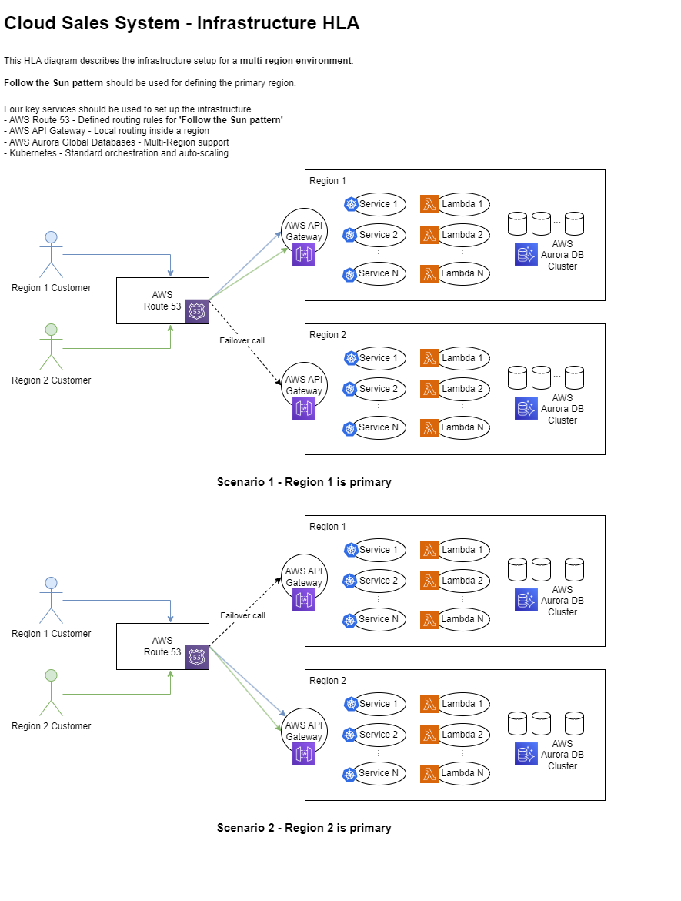
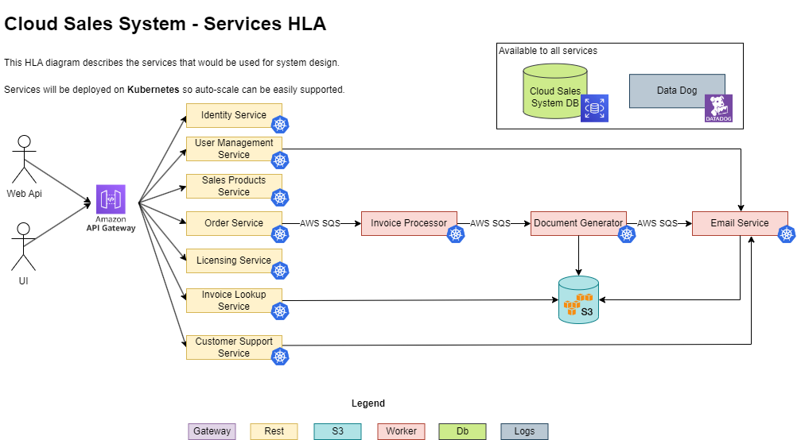
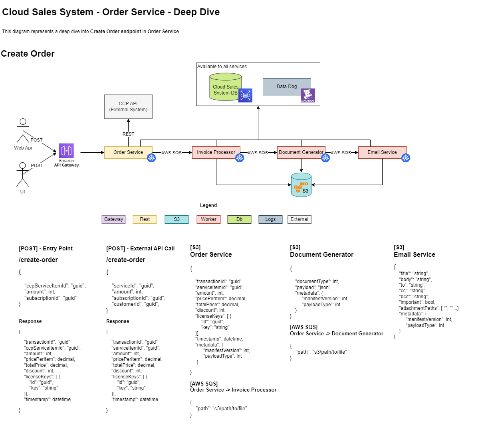
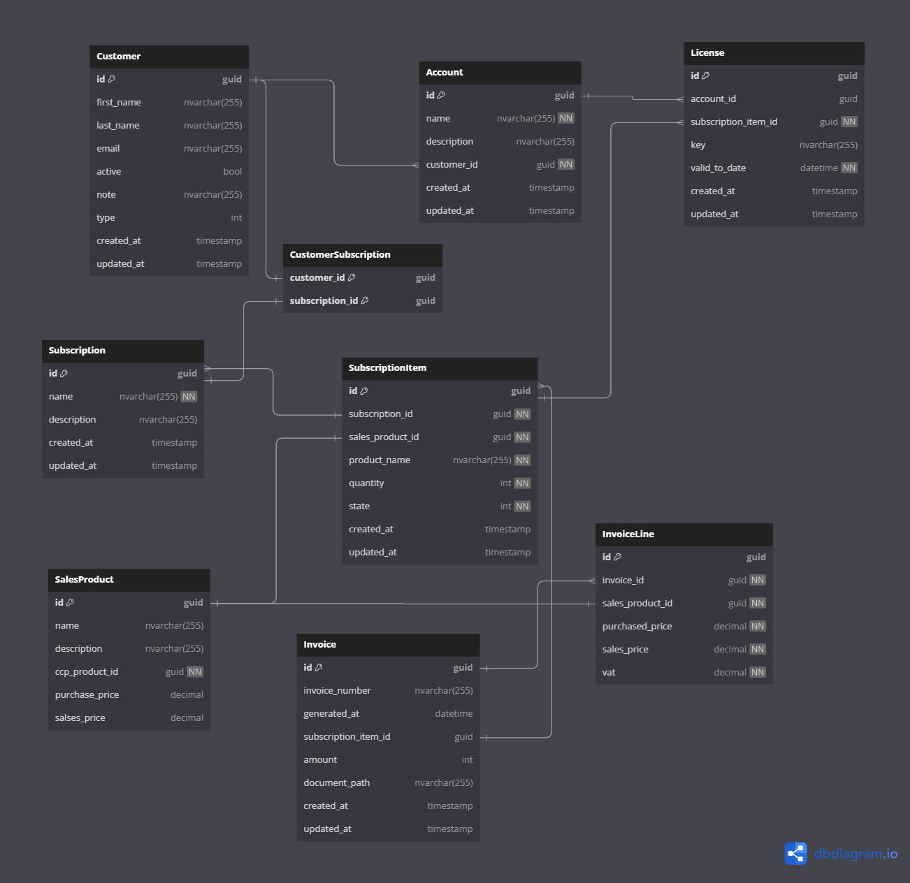

# Cloud Sales System - System Design Exercise
This is a solution for the Cloud Sales System Design exercise. 

The focus was on:
- Infrastructural HLA
- Architectural HLA
- Data modeling
- Deep diving into one of the components

## Infrastructural HLA
In requirements, there was a statement that the solution will serve customers in **Europe** and **APAC** (Asia Pacific) regions. 
This means that the focus should be on **multi-region** design.

### Follow the Sun pattern
By definition, the traditional "follow the sun" model is a type of global workflow in which issues can be handled by and passed between offices in different time zones, increasing responsiveness and reducing delays.

In the software industry and multi-region software, this means that the primary region will be the region where the day is, in this way, the main load will be on the region where the users are the most active.

Routing and primary region selection should be done using **AWS Route 53 service**.

### Auto-Scaling
Kubernetes will be used as a container orchestrator so all .NET Web Api-s, Service Workers,.. will be on Kubernetes. Increase and decrease pod policy should be defined after performance testing.

### Database
Amazon Aurora DB will be used as a database because of its great multi-region capability. This service is great and easy to use as well because PostgreSQL or MySQL can be used.

### Logs (Datadog)
The system should use a reliable system for storing the logs. One of the best products on the market is Datadog. This service can be used for logs monitoring, infrastructure monitoring, reports, and alerts...

### Final stack
- [AWS Route 53](https://aws.amazon.com/route53/)
- [AWS API Gateway](https://aws.amazon.com/api-gateway/)
- [Kubernetes](https://kubernetes.io/)
- [Docker](https://www.docker.com/)
- [AWS Aurora DB Cluster](https://docs.aws.amazon.com/AmazonRDS/latest/AuroraUserGuide/Aurora.Overview.html)
- [AWS SQS](https://aws.amazon.com/sqs/)
- [Datadog](https://www.datadoghq.com/)
- [S3](https://aws.amazon.com/s3/)
- [.NET Web API](https://dotnet.microsoft.com/en-us/apps/aspnet/apis)
- [.NET Background Workers](https://learn.microsoft.com/en-us/aspnet/core/fundamentals/host/hosted-services?view=aspnetcore-7.0&tabs=visual-studio)

## Architectural HLA
Here, the focus was on service segregation, so all major parts are in separate services. The database is shared between resources.

The idea was to have an async pipeline for order processing. When the Customer creates an order, order details are stored on **S3** as well, the path to the S3 is used to notify the **Invoice Processor**, and the notification should be sent using an **AWS SQS** message.

Next, when the invoice is ready, Invoice Processor sends invoice details to S3 and sends AWS SQS message with a file path to **Email Processor**.

The Email Processor should pick up all the attachments, and create and send an email. Email payload will be stored in S3 as well.

The reason why all the payloads are stored in S3 is because of the possibility to restart the process for an order that failed for some reason.

The S3 bucket for this pipeline will have a **cleanup policy set to 30 days**.

## Deep Dive
### Order Service

#### Create Order
Creating order is one of the most complex operations in the system so that action is used for the "Deep Dive" part.

## Data Model

## Other System Design Remarks

- **Identity Provider** - For identity provider we should use the service that satisfies all the requirements, the bonus is if the team is familiar with the chosen service.
- **Order Processor Pipeline Orchestrator Service** - This service may be used as an improvement of the existing implementation. Basically this service will control the process of creating invoices, sending emails, and error handling.
